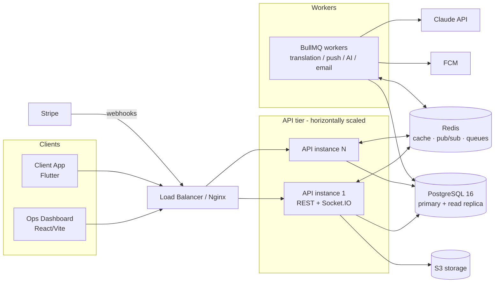
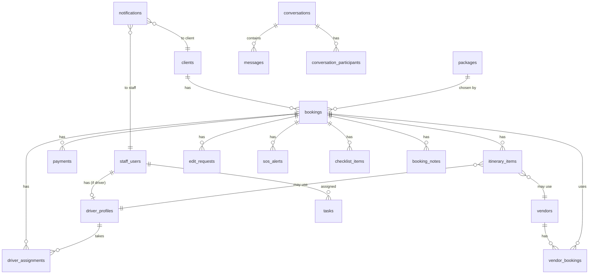

# ZEENGO — Backend Specification (Node.js + PostgreSQL)

> Companion documents: `USER_FLOW.md` (journeys) · `TECHNICAL_SPEC.md` (role-by-role features).
> This document covers: system architecture, database design, auth/RBAC, the complete REST API contract (endpoints, params, request/response JSON), WebSocket events, webhooks, background jobs, and the scalability/security plan.

---

## 1. Architecture

### 1.1 Recommended stack (best fit + scalable)

| Layer | Choice | Why |
|---|---|---|
| Runtime | **Node.js 20 LTS + TypeScript** | as required; TS for contract safety across a large API surface |
| Framework | **NestJS** (Express adapter) — or Express + TS if team prefers minimal | modular per-domain structure (bookings, payments, chat…), built-in guards for RBAC, DI, OpenAPI generation |
| ORM | **Prisma** | typed schema-first migrations for PostgreSQL, fast iteration |
| Database | **PostgreSQL 16** | relational core (bookings/payments/itineraries) + `jsonb` for flexible parts (inclusions, notification data) |
| Cache / realtime backbone | **Redis 7** | cache, WebSocket pub/sub adapter, GPS last-position store, rate limiting, queues |
| Queue | **BullMQ** (on Redis) | translation, push fan-out, AI jobs, emails, webhooks retry |
| Realtime | **Socket.IO** with Redis adapter | driver GPS stream, chat, notification push, dashboard invalidation — scales horizontally |
| Payments | **Stripe** Payment Links + Webhooks | matches the Sent → Opened → Paid tracking in the UI |
| AI | **Anthropic Claude API** | itinerary parser, Russia chatbot, email drafting, EOD report |
| Translation | Claude (same key) or Google Cloud Translate | AR ↔ RU ↔ EN chat pipeline |
| Push | **Firebase Cloud Messaging** | client app + driver notifications |
| File storage | **S3-compatible** (AWS S3 / Cloudflare R2) | avatars, chat attachments, client files |
| API docs | OpenAPI 3 (generated) | single source of truth for both frontends |

### 1.2 Topology



Principles:
- **Stateless API instances** — all shared state in Postgres/Redis → scale horizontally behind the LB; Socket.IO Redis adapter lets any instance emit to any socket.
- **Heavy/slow work never blocks a request** — AI calls, translation, push fan-out, email sending go through BullMQ.
- **Single write path** — Stripe webhook is the only thing that flips a link payment to `paid` (idempotent, signature-verified).
- **Read replicas** for dashboard analytics (Finance charts, KPI counters) when load grows; counters additionally cached in Redis with short TTL.

### 1.3 Module layout (NestJS)

```
src/
├── main.ts / app.module.ts
├── common/            # guards (JwtGuard, RolesGuard), interceptors, pagination, errors
├── auth/              # staff + client auth, OTP, refresh tokens
├── users/             # staff accounts, roles (User Management)
├── clients/           # client persons + app accounts
├── bookings/          # ZN bookings, checklist, notes
├── packages/
├── itineraries/       # programs, daily operations
├── drivers/           # profiles, status, GPS, assignments, scheduling
├── vendors/           # vendors + vendor bookings + commissions
├── payments/          # cash, stripe links, finance analytics, splizer history
├── edit-requests/     # incl. VIP requests
├── vip/               # zeen rafeq activation, vip clients
├── sos/
├── tasks/
├── chat/              # conversations, messages, translation hooks
├── notifications/     # in-app + FCM fan-out
├── ai/                # parser, russia chatbot, email drafts, EOD report
├── dashboard/         # aggregated KPI endpoints
├── webhooks/          # stripe
├── realtime/          # socket.io gateway
└── jobs/              # bullmq processors
```

---

## 2. Database Design (PostgreSQL)

### 2.1 ERD (core)



### 2.2 Tables

> Conventions: `id uuid PK default gen_random_uuid()` · `created_at/updated_at timestamptz default now()` · soft-delete via `deleted_at` where noted · money as `numeric(12,2)` USD.

**staff_users**
```sql
id uuid PK
full_name        text NOT NULL
email            citext UNIQUE NOT NULL
phone            text
password_hash    text NOT NULL
role             text NOT NULL CHECK (role IN ('admin','ops_manager','splizer','support','driver'))
avatar_url       text
is_active        boolean DEFAULT true
last_login_at    timestamptz
created_at / updated_at / deleted_at
-- INDEX (role), (email)
```

**driver_profiles** (1:1 with staff_users where role='driver')
```sql
id uuid PK
user_id          uuid UNIQUE FK -> staff_users
vehicle_make     text            -- Mercedes
vehicle_model    text            -- E-Class
vehicle_color    text            -- White
vehicle_year     int             -- 2022
plate_number     text
whatsapp         text
rating           numeric(2,1) DEFAULT 0     -- 4.8
trips_count      int DEFAULT 0
status           text NOT NULL DEFAULT 'off_duty'
                 CHECK (status IN ('available','en_route','resting','off_duty'))
last_lat / last_lng   double precision
last_gps_at      timestamptz
-- INDEX (status)
```

**gps_pings** (history; latest also mirrored to Redis `driver:gps:{id}`)
```sql
id bigserial PK
driver_id uuid FK -> driver_profiles
lat / lng double precision NOT NULL
recorded_at timestamptz DEFAULT now()
-- INDEX (driver_id, recorded_at DESC); partition by month when large
```

**clients** (the person + app account)
```sql
id uuid PK
full_name        text NOT NULL
phone            text UNIQUE NOT NULL       -- +9665…
email            citext
nationality      text                       -- 'Saudi Arabia'
whatsapp         text
password_hash    text                       -- app auth
phone_verified_at / email_verified_at timestamptz
fcm_tokens       jsonb DEFAULT '[]'
preferred_lang   text DEFAULT 'ar'
created_at / updated_at / deleted_at
```

**otp_codes**
```sql
id uuid PK
client_id uuid FK NULL          -- or phone for pre-registration
phone text NOT NULL
code_hash text NOT NULL
purpose text CHECK (purpose IN ('register','login','reset_password'))
expires_at timestamptz NOT NULL
consumed_at timestamptz
attempts int DEFAULT 0
```

**packages**
```sql
id uuid PK
name             text NOT NULL              -- 'Family Package'
slug             text UNIQUE                -- 'family-package'
price_per_person numeric(12,2) NOT NULL     -- 280.00
min_persons      int DEFAULT 1
duration_days    int
description      text
inclusions       jsonb DEFAULT '[]'         -- ["Moscow city 3 days", ...]
is_active        boolean DEFAULT true
created_at / updated_at / deleted_at        -- soft delete: keep bookings intact
```

**bookings** (the ZN entity)
```sql
id uuid PK
zn_code          text UNIQUE NOT NULL       -- 'ZN0001' (sequence-backed generator)
client_id        uuid FK -> clients
package_id       uuid FK -> packages
arrival_date     date
departure_date   date
party_size       int DEFAULT 1
total_amount     numeric(12,2) NOT NULL DEFAULT 0
status           text NOT NULL DEFAULT 'active'
                 CHECK (status IN ('active','completed','cancelled'))
is_vip           boolean DEFAULT false
vip_activated_at timestamptz
vip_activated_by uuid FK -> staff_users NULL
internal_notes   text
created_by       uuid FK -> staff_users
created_at / updated_at
-- paid_amount is DERIVED: SUM(payments.amount WHERE status='paid'); cache in Redis
-- INDEX (status), (client_id), (arrival_date), (zn_code)
```

**payments**
```sql
id uuid PK
booking_id       uuid FK -> bookings
amount           numeric(12,2) NOT NULL
method           text NOT NULL CHECK (method IN ('cash','stripe','rajhi_transfer','usdt_trc20'))
status           text NOT NULL CHECK (status IN ('pending','sent','opened','paid','expired','failed'))
location         text                       -- 'Hotel lobby, Red Square'
notes            text
collected_by     uuid FK -> staff_users NULL  -- splizer/admin who recorded / created link
stripe_payment_link_id  text
stripe_session_id       text
stripe_link_url         text
link_expires_at  timestamptz
paid_at          timestamptz
created_at / updated_at
-- cash flow: created directly with status='paid', paid_at=now()
-- stripe flow: 'sent' -> webhook 'opened' -> webhook 'paid'
-- INDEX (booking_id), (status), (method), (created_at), (collected_by)
```

**itinerary_items** (the Program)
```sql
id uuid PK
booking_id       uuid FK -> bookings
day_number       int NOT NULL               -- Day 1, 2 …
item_date        date
start_time       time
title            text NOT NULL              -- 'Bolshoi Theatre tickets'
description      text
location_name    text
lat / lng        double precision NULL      -- for client Map + Live Map POIs
vendor_id        uuid FK -> vendors NULL
driver_id        uuid FK -> driver_profiles NULL
status           text DEFAULT 'pending' CHECK (status IN ('pending','active','done','cancelled'))
sort_order       int DEFAULT 0
created_at / updated_at
-- INDEX (booking_id, day_number, sort_order), (item_date, status), (driver_id, item_date)
```

**driver_assignments**
```sql
id uuid PK
booking_id  uuid FK -> bookings
driver_id   uuid FK -> driver_profiles
start_date / end_date date
status      text DEFAULT 'active' CHECK (status IN ('active','completed','cancelled'))
assigned_by uuid FK -> staff_users
created_at
-- UNIQUE (booking_id, driver_id, start_date)
-- 'Unassigned Clients' KPI = active bookings with no active assignment
```

**vendors**
```sql
id uuid PK
name            text NOT NULL
type            text NOT NULL CHECK (type IN ('hotel','restaurant','guide','bus','activity','driver'))
city            text                        -- Moscow / Yakhorma / St. Petersburg
contact_name    text
phone / email   text
commission_pct  numeric(5,2) DEFAULT 0      -- 7.00
notes           text                        -- 'Partner since 2022, 10% discount…'
is_active       boolean DEFAULT true
created_at / updated_at / deleted_at
-- INDEX (type), (city)
```

**vendor_bookings**
```sql
id uuid PK
vendor_id          uuid FK -> vendors
booking_id         uuid FK -> bookings
itinerary_item_id  uuid FK NULL
amount             numeric(12,2)
commission_amount  numeric(12,2)            -- amount * commission_pct/100
status             text DEFAULT 'pending' CHECK (status IN ('pending','confirmed','completed','cancelled'))
created_by         uuid FK -> staff_users
created_at / updated_at
```

**edit_requests** (includes VIP requests)
```sql
id uuid PK
booking_id       uuid FK -> bookings
type             text NOT NULL CHECK (type IN ('date_change','itinerary_change','vip_upgrade','other'))
original_value   text                       -- '2026-04-23'
requested_value  text                       -- '2026-04-24'
reason           text                       -- client's explanation
status           text DEFAULT 'pending' CHECK (status IN ('pending','approved','rejected'))
review_notes     text
reviewed_by      uuid FK -> staff_users NULL
reviewed_at      timestamptz
created_at
-- INDEX (status), (booking_id)
```

**sos_alerts**
```sql
id uuid PK
booking_id   uuid FK -> bookings
message      text                           -- auto: 'طلب طوارئ من … (ZN0001)'
lat / lng    double precision NULL          -- client position at trigger
status       text DEFAULT 'active' CHECK (status IN ('active','resolved'))
resolved_by  uuid FK -> staff_users NULL
resolved_at  timestamptz
created_at
-- INDEX (status, created_at DESC)
```

**tasks**
```sql
id uuid PK
title        text NOT NULL
description  text
priority     text DEFAULT 'normal' CHECK (priority IN ('urgent','normal'))
booking_id   uuid FK -> bookings NULL
assignee_id  uuid FK -> staff_users NULL
due_date     date
status       text DEFAULT 'open' CHECK (status IN ('open','done'))
completed_at timestamptz
created_by   uuid FK -> staff_users
created_at / updated_at
-- INDEX (status, priority), (assignee_id), (due_date)
```

**checklist_items**
```sql
id uuid PK
booking_id uuid FK -> bookings
title text NOT NULL
is_done boolean DEFAULT false
sort_order int DEFAULT 0
created_by uuid NULL           -- staff or null (system)
```

**booking_notes**
```sql
id uuid PK
booking_id uuid FK -> bookings
author_id uuid FK -> staff_users
body text NOT NULL
created_at
```

**conversations**
```sql
id uuid PK
type        text NOT NULL CHECK (type IN ('team','dm','booking_support','client_direct'))
booking_id  uuid FK NULL          -- for booking_support / client_direct
title       text                  -- 'ZEENGO Ops Team', 'ZN0002 Support — فهد الشمري'
created_at
-- one 'team' global channel; booking_support auto-created with booking
```

**conversation_participants**
```sql
conversation_id uuid FK
participant_type text CHECK (participant_type IN ('staff','client'))
staff_id  uuid FK NULL
client_id uuid FK NULL
last_read_message_id uuid NULL
PRIMARY KEY (conversation_id, participant_type, coalesce(staff_id, client_id))
```

**messages**
```sql
id uuid PK
conversation_id uuid FK -> conversations
sender_type     text CHECK (sender_type IN ('staff','client','system'))
sender_staff_id uuid NULL / sender_client_id uuid NULL
body            text NOT NULL
body_translated jsonb DEFAULT '{}'   -- {"ru":"…","ar":"…","en":"…"}
source_lang     text                 -- 'ar'
attachments     jsonb DEFAULT '[]'   -- [{url,type,name}]
created_at
-- INDEX (conversation_id, created_at DESC)
```

**notifications**
```sql
id uuid PK
recipient_type text CHECK (recipient_type IN ('staff','client'))
staff_id uuid NULL / client_id uuid NULL
type   text CHECK (type IN ('sos','payment','task','chat','edit_request','vip','system','assignment','program'))
title  text NOT NULL
body   text
data   jsonb DEFAULT '{}'        -- {booking_id, zn_code, deep_link, entity_id}
read_at timestamptz NULL
created_at
-- INDEX (staff_id, read_at), (client_id, read_at), (type)
```

**eod_reports**
```sql
id uuid PK
report_date date UNIQUE
content text            -- Claude-generated markdown
generated_by uuid FK -> staff_users
sent_at timestamptz
created_at
```

**audit_logs**
```sql
id bigserial PK
actor_type text ('staff','client','system','webhook')
actor_id uuid NULL
action text            -- 'booking.create', 'edit_request.approve', 'payment.record' …
entity text / entity_id uuid
diff jsonb
created_at
-- append-only; INDEX (entity, entity_id), (actor_id)
```

**settings** (key-value, admin-editable)
```sql
key text PK              -- 'vip_price', 'stripe_link_expiry_hours', 'company_profile'
value jsonb
updated_by uuid / updated_at
```

### 2.3 ZN code generation
Postgres sequence + formatted: `'ZN' || lpad(nextval('zn_seq')::text, 4, '0')` inside the booking-create transaction — guarantees uniqueness under concurrency (grows to 5 digits naturally after ZN9999).

---

## 3. Auth & RBAC

### 3.1 Tokens
- **Staff:** email + password → access JWT (15 min, payload `{sub, role, type:'staff'}`) + refresh token (30d, rotated, stored hashed in Redis/DB; revoked on logout/password change).
- **Client (app):** phone + password with **SMS OTP** on register/reset; same JWT scheme, `type:'client'`.
- Headers: `Authorization: Bearer <access>`; refresh via `POST /auth/refresh`.

### 3.2 RBAC guard matrix (enforced server-side, mirrors `TECHNICAL_SPEC.md §0.2`)

| Resource | admin | ops_manager | splizer | support | driver | client |
|---|---|---|---|---|---|---|
| dashboard/ops-room/daily aggregates | RW | RW | – | – | – | – |
| bookings CRUD | RW | RW | R (payment fields only) | RW | – | R (own) |
| packages | RW | R | – | – | – | R |
| payments record / stripe link | RW | RW | RW | R | – | R (own) + pay |
| finance analytics | R | R | – | – | – | – |
| vendors | RW | RW | – | RW | – | – |
| drivers / scheduling | RW | RW | – | – | R/W (self only) | R (assigned driver card) |
| edit-requests review | RW | RW | – | RW | – | create + R (own) |
| sos resolve | RW | RW | – | RW | – | create |
| vip activate/approve | RW | RW | – | – | – | request |
| tasks | RW | RW | R (own) | RW | R (own) | – |
| chat: team | RW | RW | – | RW | – | – |
| chat: client threads | RW | RW | RW | RW | RW (assigned only) | RW (own) |
| ai tools (parser/chatbot/email/eod) | RW | RW | chatbot only | chatbot+email | chatbot only | – |
| notifications | R (own) | R (own) | R (own) | R (own) | R (own) | R (own) |
| user management / settings | RW | – | – | – | – | – |

Implementation: `@Roles('admin','ops_manager')` decorator + `RolesGuard`; **row-level scoping** in services (driver → own assignments; client → own booking; splizer chat → all clients but read-only booking data).

---

## 4. REST API Contract

Base URL: `/api/v1`. All responses share an envelope:

```json
{ "success": true, "data": { }, "meta": { "page": 1, "limit": 20, "total": 132 } }
```
```json
{ "success": false, "error": { "code": "BOOKING_NOT_FOUND", "message": "Booking ZN0042 not found", "details": null } }
```

Pagination: `?page=1&limit=20` · sorting: `?sort=-created_at` · common HTTP codes: 200/201/204, 400 validation, 401, 403, 404, 409 conflict, 422, 429.

### 4.1 Auth

| Method | Path | Who | Body / Params |
|---|---|---|---|
| POST | `/auth/staff/login` | staff | `{ "email", "password" }` → `{ accessToken, refreshToken, user }` |
| POST | `/auth/client/register` | public | `{ "fullName", "phone", "email", "password", "nationality" }` → sends OTP |
| POST | `/auth/client/verify-otp` | public | `{ "phone", "code", "purpose": "register" }` → tokens |
| POST | `/auth/client/login` | public | `{ "phone", "password" }` |
| POST | `/auth/forgot-password` | public | `{ "phone" }` → OTP |
| POST | `/auth/reset-password` | public | `{ "phone", "code", "newPassword" }` |
| POST | `/auth/change-password` | any | `{ "currentPassword", "newPassword" }` |
| POST | `/auth/refresh` | any | `{ "refreshToken" }` → new pair |
| POST | `/auth/logout` | any | revokes refresh token |
| GET | `/auth/me` | any | profile + role |
| PUT | `/auth/me/fcm-token` | client/driver | `{ "token", "platform": "android" }` |

Login response example:
```json
{
  "success": true,
  "data": {
    "accessToken": "eyJ…",
    "refreshToken": "eyJ…",
    "user": { "id": "uuid", "fullName": "Amine Lahouideg", "email": "admin@zeengo.com", "role": "admin", "avatarUrl": null }
  }
}
```

### 4.2 Dashboard aggregates (admin, ops_manager)

| Method | Path | Notes |
|---|---|---|
| GET | `/dashboard/summary` | all KPI cards in one call (30s cache) |
| GET | `/dashboard/urgent-alerts` | merged SOS + pending edit requests + urgent tasks |
| GET | `/dashboard/schedule?date=today\|tomorrow` | events list |
| POST | `/dashboard/eod-report` | `{ "date": "2026-07-31" }` → generates via Claude (job) |
| POST | `/dashboard/eod-report/:id/send` | distributes to team chat + email |

`GET /dashboard/summary` response:
```json
{
  "success": true,
  "data": {
    "activeClients": { "count": 11, "arrivingToday": 0, "departingToday": 0 },
    "urgentTasks": { "count": 2, "overdue": 0, "open": 2 },
    "driversInField": { "count": 1, "available": 2, "enRoute": 1 },
    "revenueToday": { "collected": 0, "pending": 1750 },
    "todaysItinerary": { "percent": 0, "done": 0, "active": 0, "total": 0 },
    "unassignedClients": 5,
    "opsQueue": { "vendorPending": 0, "overdueTasks": 8 }
  }
}
```

### 4.3 Clients & Bookings

| Method | Path | Who | Notes |
|---|---|---|---|
| GET | `/bookings` | staff | `?search=&status=active&page=&limit=` — powers Client List + Booking Codes tabs (`?view=codes` adds stats) |
| POST | `/bookings` | admin, ops, support | create booking (ZN auto) |
| GET | `/bookings/:id` | staff / owning client | full profile |
| PATCH | `/bookings/:id` | admin, ops, support | dates, party, notes, status |
| GET | `/bookings/stats` | staff | `{ total, active, completed, cancelled }` |
| GET | `/bookings/:id/payments` | staff / owner | payments list |
| GET/POST/PATCH/DELETE | `/bookings/:id/checklist(/:itemId)` | staff (+client toggle) | checklist CRUD |
| GET/POST | `/bookings/:id/notes` | staff | internal notes |
| GET | `/clients/:id` | staff | person record |
| PATCH | `/clients/:id` | admin, ops, support | contact fields |

`POST /bookings` request:
```json
{
  "client": {
    "fullName": "Mohammed Al-Rashidi",
    "phone": "+966512345678",
    "email": "client@email.com",
    "nationality": "Saudi Arabia"
  },
  "partySize": 5,
  "arrivalDate": "2026-07-29",
  "departureDate": "2026-08-14",
  "packageId": "uuid-royal-package",
  "totalAmount": 6000,
  "internalNotes": "Any special requests…"
}
```
Response `201`:
```json
{
  "success": true,
  "data": {
    "id": "uuid",
    "znCode": "ZN4318",
    "status": "active",
    "isVip": false,
    "client": { "id": "uuid", "fullName": "Mohammed Al-Rashidi", "phone": "+966512345678", "nationality": "Saudi Arabia" },
    "package": { "id": "uuid", "name": "Royal Package" },
    "arrivalDate": "2026-07-29",
    "departureDate": "2026-08-14",
    "partySize": 5,
    "totalAmount": 6000,
    "paidAmount": 0,
    "dueAmount": 6000,
    "driver": null,
    "createdAt": "2026-07-31T14:00:00Z"
  }
}
```

### 4.4 Itinerary / Program & Daily Operations

| Method | Path | Who |
|---|---|---|
| GET | `/bookings/:id/itinerary` | staff / owner client |
| POST | `/bookings/:id/itinerary/items` | admin, ops, support |
| PATCH | `/itinerary/items/:itemId` | admin, ops, support (+driver: status only on own items) |
| DELETE | `/itinerary/items/:itemId` | admin, ops, support |
| POST | `/bookings/:id/itinerary/import` | admin, ops — body = AI-parsed JSON |
| GET | `/daily-operations?date=2026-07-31` | admin, ops — all items that day grouped by booking |
| GET | `/daily-operations/week?start=2026-07-30` | day-strip counters |

Itinerary item shape:
```json
{
  "id": "uuid",
  "dayNumber": 1,
  "itemDate": "2026-07-29",
  "startTime": "08:00",
  "title": "Arrival at Sheremetyevo Airport",
  "description": "Meet & greet at terminal",
  "locationName": "SVO Terminal C",
  "lat": 55.9726, "lng": 37.4146,
  "vendor": { "id": "uuid", "name": "VIP Moscow Transfer" },
  "driver": { "id": "uuid", "name": "Alexei Sokolov" },
  "status": "pending",
  "sortOrder": 0
}
```

### 4.5 Packages

| Method | Path | Who |
|---|---|---|
| GET | `/packages` | staff + client app |
| POST | `/packages` | admin |
| PATCH | `/packages/:id` | admin |
| DELETE | `/packages/:id` | admin (soft) |

```json
{
  "name": "Family Package",
  "slug": "family-package",
  "pricePerPerson": 280,
  "minPersons": 1,
  "durationDays": 5,
  "description": "Moscow 3 days + Yakhorma 2 days family adventure",
  "inclusions": ["Moscow city 3 days", "Yakhorma countryside 2 days", "Russian farm visit", "Private halal bus", "Halal restaurants only"]
}
```

### 4.6 Payments & Splizer

| Method | Path | Who | Notes |
|---|---|---|---|
| GET | `/splizer/clients` | splizer, admin, ops | list with total/paid/due, `?search=&status=` |
| GET | `/splizer/clients/by-code/:znCode` | same | "Search Client by Code" |
| POST | `/payments/cash` | splizer, admin, ops | record cash/transfer collection |
| POST | `/payments/stripe-link` | splizer, admin, ops | create payment link |
| GET | `/payments/history` | splizer (own+all), admin, ops | `?from=&to=&search=` |
| GET | `/finance/summary` | admin, ops | KPI cards |
| GET | `/finance/revenue-by-method?days=30` | admin, ops | chart series |
| GET | `/payments` | admin, ops | all-payments table `?status=&method=&page=` |

`POST /payments/cash`:
```json
{
  "bookingId": "uuid",
  "amount": 500,
  "method": "cash",
  "location": "Hotel lobby, Red Square",
  "notes": "First installment"
}
```
→ `201 { "id", "status": "paid", "paidAt": "…", "collectedBy": { "id", "name": "Khalid Al-Zahrani" } }`
Side-effects: booking paid/due recomputed, WS `payment.recorded`, notification to admin/ops.

`POST /payments/stripe-link`:
```json
{ "bookingId": "uuid", "amount": 6000, "expiresInHours": 48 }
```
→
```json
{
  "success": true,
  "data": {
    "paymentId": "uuid",
    "url": "https://buy.stripe.com/…",
    "status": "sent",
    "expiresAt": "2026-08-02T14:00:00Z"
  }
}
```

### 4.7 Vendors

| Method | Path | Who |
|---|---|---|
| GET | `/vendors?type=hotel&city=&search=` | admin, ops, support |
| POST | `/vendors` | admin, ops, support |
| GET | `/vendors/:id` (+ `?include=bookings,finance`) | same |
| PATCH / DELETE | `/vendors/:id` | admin, ops |
| POST | `/vendors/:id/assign` | admin, ops, support — `{ "bookingId", "itineraryItemId?", "amount?" }` |
| GET | `/vendors/:id/finance` | admin, ops — commission ledger |

### 4.8 Drivers

| Method | Path | Who | Notes |
|---|---|---|---|
| GET | `/drivers?status=&search=` | admin, ops | roster + filters |
| GET | `/drivers/:id` | admin, ops | profile + rating + vehicle |
| PATCH | `/drivers/:id` | admin, ops | Manage tab |
| GET | `/drivers/:id/schedule?date=` | admin, ops | per-date programs |
| GET | `/drivers/:id/trips` | admin, ops | trip history |
| POST | `/drivers/assignments` | admin, ops | `{ "bookingId", "driverId", "startDate", "endDate" }` |
| DELETE | `/drivers/assignments/:id` | admin, ops | unassign |
| GET | `/drivers/me/schedule?date=today` | driver | own trips + counters |
| PUT | `/drivers/me/status` | driver | `{ "status": "en_route" }` |
| POST | `/drivers/me/gps` | driver | `{ "lat": 55.75, "lng": 37.61 }` every 30s (also via WS) |
| GET | `/drivers/live-positions` | admin, ops | Live Map markers (Redis-backed) |

### 4.9 Edit Requests

| Method | Path | Who |
|---|---|---|
| GET | `/edit-requests?status=pending` | admin, ops, support |
| POST | `/edit-requests` | client (app) |
| GET | `/edit-requests/:id` | staff / owner |
| POST | `/edit-requests/:id/approve` | admin, ops, support — `{ "reviewNotes?" }` |
| POST | `/edit-requests/:id/reject` | admin, ops, support — `{ "reviewNotes?" }` |
| GET | `/bookings/:id/edit-requests` | staff / owner |

Client create:
```json
{
  "type": "date_change",
  "originalValue": "2026-04-23",
  "requestedValue": "2026-04-24",
  "reason": "Family needs one extra day in Moscow for shopping. Request to shift Yakhorma by 1 day."
}
```
Approve response includes applied change:
```json
{
  "success": true,
  "data": {
    "id": "uuid", "status": "approved",
    "reviewedBy": { "id": "uuid", "name": "Amine Lahouideg" },
    "reviewedAt": "2026-07-31T14:10:00Z",
    "applied": { "field": "departure_date", "from": "2026-04-23", "to": "2026-04-24" }
  }
}
```
Approving `type=vip_upgrade` triggers the VIP activation flow (§4.10).

### 4.10 Zeen Rafeq VIP

| Method | Path | Who |
|---|---|---|
| GET | `/vip/overview` | admin, ops — price, services, ops line |
| POST | `/vip/activate` | admin, ops — `{ "bookingId" }` → `is_vip=true`, `total += vip_price`, audit |
| GET | `/vip/requests` | admin, ops — pending vip_upgrade edit-requests |
| GET | `/vip/clients` | admin, ops — active VIP bookings |
| POST | `/vip/request` | client — creates `edit_requests(type='vip_upgrade')` |

### 4.11 SOS

| Method | Path | Who |
|---|---|---|
| POST | `/sos` | client — `{ "message?", "lat?", "lng?" }` |
| GET | `/sos?status=active\|resolved` | admin, ops, support |
| POST | `/sos/:id/resolve` | admin, ops, support |
| GET | `/sos/:id` | staff |

`POST /sos` side-effects (transactional + jobs): create alert → WS `sos.created` to all admin/ops/support sockets → in-app notifications + FCM → badge counters bumped → booking_support conversation pinned.

### 4.12 Tasks

| Method | Path | Who |
|---|---|---|
| GET | `/tasks?status=open&priority=urgent&assignee=me` | staff |
| POST | `/tasks` | admin, ops, support |
| PATCH | `/tasks/:id` | admin, ops (+assignee can complete) |
| POST | `/tasks/:id/complete` | assignee/admin/ops |

```json
{ "title": "Confirm Bolshoi Theatre tickets — ZN0001", "priority": "urgent", "bookingId": "uuid", "assigneeId": "uuid", "dueDate": "2026-08-01" }
```

### 4.13 Chat

| Method | Path | Who |
|---|---|---|
| GET | `/chat/conversations` | any (role-scoped list) |
| POST | `/chat/conversations` | staff — `{ "type": "dm", "participantIds": [] }` |
| GET | `/chat/conversations/:id/messages?before=<cursor>&limit=50` | participant |
| POST | `/chat/conversations/:id/messages` | participant — `{ "body", "attachments?" }` |
| POST | `/chat/conversations/:id/read` | participant — `{ "lastMessageId" }` |
| GET | `/chat/client-threads` | splizer, driver — client list with due amounts + presence |

Message response:
```json
{
  "id": "uuid",
  "conversationId": "uuid",
  "sender": { "type": "client", "id": "uuid", "name": "فهد الشمري" },
  "body": "متى يصل السائق؟",
  "bodyTranslated": { "ru": "Когда приедет водитель?", "en": "When does the driver arrive?" },
  "sourceLang": "ar",
  "createdAt": "2026-07-31T14:20:00Z"
}
```
(Translation is queued; a `message.translated` WS patch follows if not ready at send time.)

### 4.14 Notifications

| Method | Path | Who |
|---|---|---|
| GET | `/notifications?filter=all\|unread\|sos\|payments\|tasks\|chat` | any (own) |
| POST | `/notifications/:id/read` | owner |
| POST | `/notifications/read-all` | owner |
| GET | `/notifications/unread-count` | owner (badge) |

### 4.15 AI tools

| Method | Path | Who | Body |
|---|---|---|---|
| POST | `/ai/parse-itinerary` | admin, ops | `{ "rawText": "Day 1 — Moscow Airport Transfer\n08:00 Arrival…" }` |
| POST | `/ai/chatbot` | all staff | `{ "sessionId?", "message": "أين مطاعم حلال قريبة؟" }` |
| POST | `/ai/email-draft` | admin, ops, support | `{ "vendorType": "hotel", "vendorName": "Lotte Hotel Moscow", "bookingDate": "2026-08-01", "guests": 4, "specialRequests": "Halal food, prayer room, early check-in", "language": "en" }` |
| POST | `/ai/eod-report` | admin, ops | `{ "date" }` |

`/ai/parse-itinerary` response:
```json
{
  "success": true,
  "data": {
    "days": [
      {
        "dayNumber": 1,
        "title": "Moscow Airport Transfer",
        "items": [
          { "time": "08:00", "title": "Arrival at Sheremetyevo Airport" },
          { "time": "11:00", "title": "Check-in Lotte Hotel Moscow" },
          { "time": "14:00", "title": "Red Square walking tour" },
          { "time": "19:00", "title": "White Rabbit Restaurant dinner" }
        ]
      }
    ]
  }
}
```
AI calls run as BullMQ jobs with SSE/WS progress for long responses; per-user rate limit (e.g. 20 req/hour) and prompt-injection-safe system prompts.

### 4.16 User Management & Settings (admin)

| Method | Path | Notes |
|---|---|---|
| GET | `/users?role=splizer` | staff list + role counts (`/users/stats`) |
| POST | `/users` | `{ "fullName", "email", "phone", "role", "password" }` — role=driver also creates driver_profile |
| PATCH | `/users/:id` | edit / change role / deactivate |
| POST | `/users/:id/reset-password` | temp password issue |
| GET/PUT | `/settings` / `/settings/:key` | key-value config |
| GET | `/system/health` | Support page: api/db/ws/stripe/claude status |

### 4.17 Webhooks

| Method | Path | Source |
|---|---|---|
| POST | `/webhooks/stripe` | Stripe — signature-verified (`STRIPE_WEBHOOK_SECRET`) |

Handled events → payment status transitions (idempotent by `event.id`, stored to dedupe):
- `checkout.session.completed` / `payment_link` paid → `paid` (+`paid_at`)
- link viewed (via session created) → `opened`
- expiry job → `expired`
On `paid`: recompute booking due, WS `payment.updated`, notify splizer + admin/ops + client push.

---

## 5. WebSocket Contract (Socket.IO)

Namespace `/ws`, auth via JWT in handshake. Server joins sockets to rooms:
`role:admin`, `role:ops_manager`, `role:support`, `role:splizer`, `user:{staffId}`, `client:{clientId}`, `booking:{bookingId}`, `drivers:live-map`.

**Server → client events**

| Event | Room(s) | Payload |
|---|---|---|
| `sos.created` / `sos.resolved` | role:admin/ops/support | `{ id, znCode, clientName, message, createdAt }` |
| `edit_request.created` / `.decided` | staff roles / client | request summary |
| `payment.recorded` / `payment.updated` | role:admin/ops, user:{collector}, client | `{ paymentId, bookingId, status, amount }` |
| `booking.updated` / `program.updated` | booking:{id} (client app live sync) | changed fields |
| `task.created` / `task.completed` | user:{assignee}, role:admin/ops | task |
| `driver.status` | role:admin/ops | `{ driverId, status }` |
| `driver.gps` | drivers:live-map | `{ driverId, lat, lng, at }` |
| `message.new` / `message.translated` | conversation participants | message |
| `notification.new` | user:{id} / client:{id} | notification (badge bump) |
| `assignment.created` | user:{driverId} | trip assignment |

**Client → server events**

| Event | Who | Payload |
|---|---|---|
| `gps.ping` | driver | `{ lat, lng }` (every 30s; server throttles) |
| `presence.subscribe` | staff | conversation/booking rooms |
| `typing` | chat participants | `{ conversationId }` |

---

## 6. Background Jobs (BullMQ queues)

| Queue | Jobs | Notes |
|---|---|---|
| `translation` | translate message → patch `body_translated`, emit `message.translated` | retry 3×, <2s target |
| `push` | FCM fan-out for notifications | batch by token; prune dead tokens |
| `ai` | parse-itinerary, chatbot turns, email drafts, EOD report | per-user rate limit, 60s timeout |
| `payments` | expire stale Stripe links (cron every 10 min), reconcile with Stripe (nightly) | idempotent |
| `digest` | EOD report auto-generate at 22:00 ops time (cron) | admin can regenerate |
| `cleanup` | GPS history partition rotation, OTP purge, audit retention | cron |

---

## 7. Security

- **Passwords:** argon2id; OTP: 6-digit, hashed, 5-min expiry, max 5 attempts, per-phone rate limit.
- **JWT:** short-lived access + rotated refresh (revocation list in Redis); separate secrets for staff/client if desired.
- **RBAC in depth:** route guards + service-level row scoping (never trust the client for `bookingId` ownership).
- **Validation:** DTO validation (class-validator/zod) on every endpoint; whitelist-only fields.
- **Stripe:** verify webhook signatures; never trust client-reported payment status.
- **Rate limiting:** global (Redis token bucket) + strict on auth/OTP/AI endpoints.
- **Transport:** TLS everywhere; CORS locked to dashboard + app origins; helmet headers.
- **PII:** phone/email access logged in `audit_logs`; client data export/delete path for compliance.
- **Uploads:** signed S3 URLs, content-type + size validation, no public bucket listing.
- **Secrets:** env only (see §9), never committed.

---

## 8. Scalability Plan

| Stage | Setup |
|---|---|
| Launch | 2× API instances + 1 worker, single Postgres (managed, e.g. RDS/Neon), single Redis, Nginx LB — handles thousands of daily ops comfortably |
| Growth | Read replica for Finance/dashboard aggregates; Redis cluster; worker pool per queue; GPS pings via WS only + Redis (skip per-ping SQL, batch-flush history) |
| Later | Partition `gps_pings`/`messages`/`audit_logs` by month; CDN for assets; move Live Map fan-out to dedicated realtime node; OpenTelemetry tracing |

Performance guards: dashboard aggregates cached 15–30s in Redis (matches UI refresh); N+1-free list endpoints (joined selects); cursor pagination on messages/notifications; DB indexes as specified in §2.2.

Observability: pino structured logs → Loki/CloudWatch; Sentry for errors; `/system/health` powers the dashboard Support page; queue dashboards (Bull Board) internal-only.

---

## 9. Environment Variables

```
NODE_ENV / PORT
DATABASE_URL=postgres://…
REDIS_URL=redis://…
JWT_SECRET / JWT_REFRESH_SECRET
JWT_ACCESS_TTL=15m / JWT_REFRESH_TTL=30d
STRIPE_SECRET_KEY / STRIPE_WEBHOOK_SECRET
ANTHROPIC_API_KEY
GOOGLE_MAPS_API_KEY
FCM_SERVICE_ACCOUNT_JSON (base64)
S3_ENDPOINT / S3_BUCKET / S3_ACCESS_KEY / S3_SECRET_KEY
SMS_PROVIDER_KEY (OTP — e.g. Twilio/Unifonic for +966)
APP_WEB_ORIGIN / APP_MOBILE_SCHEME (CORS/deep links)
VIP_PRICE_USD=100 (default; overridable in settings table)
STRIPE_LINK_DEFAULT_EXPIRY_HOURS=48
```

---

## 10. Build Order (suggested milestones)

1. **Foundation:** auth (staff+client, OTP), users/roles, RBAC guards, settings, health.
2. **Core domain:** packages → bookings (ZN gen) → client profile tabs (checklist, notes) → itinerary CRUD + daily operations queries.
3. **Money:** payments (cash) → Stripe links + webhook → Splizer module endpoints → finance aggregates.
4. **Field ops:** drivers + assignments + GPS + live map → tasks → dashboard/ops-room aggregates.
5. **Client interactions:** edit requests (+VIP) → SOS → chat + translation queue → notifications + FCM.
6. **AI layer:** parser, chatbot, email drafts, EOD report.
7. **Hardening:** audit logs, rate limits, monitoring, load test (esp. WS GPS + chat), backup/restore drill.
