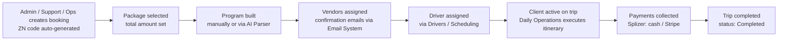

# ZEENGO — Complete User Flow & Functionality Specification

ZEENGO is a travel operations platform for Saudi/Arab tourists visiting Russia (Moscow, Yakhorma, St. Petersburg).
It has **one Ops Dashboard (web)** with 5 staff roles and **one Client mobile app (Flutter)**.

| # | User Type | Where | Purpose |
|---|-----------|-------|---------|
| 1 | **Admin** | Dashboard | Full control — operations, finance, staff, system |
| 2 | **Operations Manager** | Dashboard | Day-to-day operations (same command tools as Admin, no system administration) |
| 3 | **Splizer** (Payment Collector) | Dashboard | Collects client payments — cash in the field + Stripe links |
| 4 | **Support** | Dashboard | Client care — SOS, client records, edit requests, vendors, comms |
| 5 | **Driver** | Dashboard (mobile-friendly) | Own schedule, trip status, GPS broadcast, client chat |
| 6 | **Client** | Mobile App (Flutter) | Trip booking view, program, payments, chat, SOS, edit requests, VIP |

Every booking gets an auto-generated **ZN#### code** (e.g. `ZN0001`, `ZN4318`) — this code links the client across every module: payments, chat, SOS, edit requests, driver trips, notifications.

**Global UI (all dashboard roles):** top bar with global client search, theme toggle, **AR ↔ EN language switch**, notification bell with unread badge, profile menu, logout. Sidebar is **role-scoped** — each role only sees the modules they are allowed to use.

---

## 1. ADMIN — Full Flow

Admin sees the complete sidebar, grouped into 6 sections:

- **COMMAND:** Dashboard · Operations Room · Daily Operations · SOS Alerts
- **CLIENTS:** Clients · Edit Requests
- **FLEET:** Drivers · Vendors
- **FINANCE:** Splizer · Finance · Packages · Zeen Rafeq VIP
- **TOOLS:** Team Chat · AI Parser · Russia Chatbot · Email System
- **SYSTEM:** Notifications · Support · User Management · Settings

### 1.1 Dashboard (Ops Dashboard)

Real-time overview, **auto-refresh every 30s**, manual Refresh button, "urgent" count badge in header.

**KPI cards (top row):**
1. **Active Clients** — count + arriving/departing today breakdown
2. **Urgent Tasks** — count + overdue / open split
3. **Drivers in Field** — count + available / en-route split
4. **Revenue Today** — collected $ + pending $
5. **Today's Itinerary** — % complete (done / active / total items)
6. **Unassigned Clients** — active clients without a driver + **"Assign now →"** shortcut
7. **Ops Queue** — vendor-pending count + overdue tasks count

**Panels:**
- **Urgent Alerts** — combined feed: active **SOS** alerts (View → SOS page), pending **Edit Requests** (Review → opens review modal), urgent tasks with booking codes. This is the "act now" list.
- **Driver Board** — every driver with live status pill (AVAILABLE / EN ROUTE / RESTING / OFF DUTY) + one-tap call button. "Manage →" opens Drivers module.
- **Pending Urgent Tasks** — open urgent tasks with client + due date; checkbox to complete.
- **Today's Schedule / Tomorrow** — event lists for today and tomorrow.
- **End of Day Report** — AI-generated operations summary, **Send** button (distributes the report).

**Flow:** Admin logs in → lands here → scans KPIs → clears Urgent Alerts first (SOS → Edit Requests → tasks) → uses Assign-now for driverless clients → sends End-of-Day report at close.

### 1.2 Operations Room

Live 3-column command center, **auto-refresh every 15s** — the "war room" during active trip days.

- **Column 1:** Today's Events · **Urgent Tasks** (checkable, priority-tagged) · **Other Tasks** (normal priority — e.g. "Send welcome package — ZN0006", "Weekly driver performance review")
- **Column 2:** **Driver Board** (status pills) · **Live Map** — Google Maps with real-time driver positions and client POIs
- **Column 3:** **SOS Alerts** (red, with client + code) · **Edit Requests** (pending, click to review) · **Quick Actions**:
  - **+ New Client Booking** → opens booking form (same as Clients → New Client)
  - **Open Splizer / Collect Payment** → jumps to Splizer module
  - **AI Package Parser** → jumps to AI Parser tool
- **+ Add Task** (top right) → create a task (title, priority urgent/normal, linked booking code, assignee, due date)

### 1.3 Daily Operations

Day-by-day itinerary execution view.

- Week strip (Sat–Wed …) — pick a day; each day shows counts: **clients / items / active / done**
- Date picker for jumping to any date
- Body lists every itinerary item scheduled that day (time, client, activity, vendor, driver, status). Empty state: "Nothing scheduled".

**Flow:** each morning, ops opens today → works down the itinerary items → marks done as the day progresses (feeds the Dashboard "Today's Itinerary %").

### 1.4 SOS Alerts

Emergency handling. Sidebar badge shows active count.

- Tabs: **Active** / **History**
- Each active alert card: elapsed time ("1d ago"), client name (Arabic) + ZN code, **View file →** (client profile), alert message, **In-App Chat** button (direct chat with the client), **Resolve** button.
- **Emergency Protocol** checklist pinned at the bottom:
  1. Call the client immediately
  2. Notify the nearest driver via the Drivers board
  3. If medical: call 103 (ambulance) or 112 (emergency)
  4. Mark the SOS as resolved once the situation is handled

**Flow:** client taps SOS in app → alert appears here + Dashboard Urgent Alerts + Notifications (all roles that see SOS) → staff calls client → dispatches nearest driver → chats in-app if needed → **Resolve** → alert moves to History.

### 1.5 Clients

Two tabs: **Client List** and **Booking Codes (ZN)**.

**Client List:** search (name / ZN code / phone), status filter (All / Active / Completed / Cancelled), **+ New Client** button. Table columns: client (name, nationality, pax), ZN code, arrival date, package, total amount, paid / due, status pill, quick actions (chat, open profile).

**Booking Codes (ZN) tab:** stat cards — **Total / Active / Completed / Cancelled**; search by ZN code, name, phone, nationality; table: ZN code (with copy button), client name + phone + VIP badge, package, dates (arrival → departure), status, created, **Open** action.

**New Client Booking form** (`ZN#### auto-generated on creation`):
- Client Information: Full Name*, Phone (+966…), Email, Nationality, Party Size
- Trip Details: Arrival Date, Departure Date, Package (dropdown from Packages module), Total Amount (USD), Internal Notes
- **Create Client Booking** → booking created with ZN code, appears everywhere.

**Client Profile** (open any client):
- Header: name, VIP badge (if Zeen Rafeq), status pill, quick actions (chat, add, edit)
- **Payment bar:** Total / Paid / Due / Arrival / Departure / Party (pax + nationality)
- Tabs:
  - **Info** — contact (phone, email, pax, nationality, WhatsApp button) + trip details (arrival, departure, package, assigned driver or "Not assigned")
  - **Program** — the day-by-day trip itinerary (built manually or via AI Parser)
  - **Payments** — every payment on this booking (method, amount, status)
  - **Chat** — direct client conversation (auto-translated)
  - **Checklist** — trip preparation checklist (badge shows remaining count)
  - **Notes** — internal staff notes

### 1.6 Edit Requests (feature)

Client program change requests — review and approve.

- Tabs: **Pending / Approved / Rejected / All**
- Request card: status pill, request type (e.g. **Date Change**), client name, ZN code, requested value, client's reason (e.g. *"Family needs one extra day in Moscow for shopping. Request to shift Yakhorma by 1 day."*), timestamp.
- Click → **Review Edit Request modal:**
  - Client, Booking Code, Request Type, Status
  - **Original Value** vs **Requested Change** (side by side, e.g. `2026-04-23` → `2026-04-24`)
  - Reason (from client)
  - **Review Notes (optional)** — note for the client or team
  - Actions: **Approve** / **Reject** / Cancel
- **VIP upgrade requests** also arrive through this pipeline (client requests Zeen Rafeq VIP $100 from the app → shows as Edit Request + notification).

**Lifecycle:** client submits from app → Pending + notification + Dashboard Urgent Alerts → Admin/Ops/Support reviews → Approve (program/dates updated, client notified) or Reject (with note) → moves to Approved/Rejected tab.

### 1.7 Drivers

Two top tabs: **Driver Roster** and **Scheduling**.

**Driver Hub (left panel):** filters **All / Free / Active / Rest / Off**, search by name / vehicle / plate, driver list (rating, trip count, status).

**Driver detail (right panel):** avatar, name, availability pill, rating (e.g. 4.8 ★, 201 trips), vehicle (e.g. Mercedes E-Class — White 2022, plate), phone + WhatsApp, GPS last-update. Tabs:
- **Schedule** — per-date programs assigned to this driver (date picker + Today)
- **Trip History** — completed trips
- **Manage** — edit driver info, vehicle, status

**Scheduling tab:** assign drivers to client programs by date (this clears the "Unassigned Clients" KPI).

### 1.8 Vendors

Vendor Management — hotels, restaurants, guides, buses, activities & drivers.

- Category tabs: **All / Hotels / Restaurants / Guides / Buses / Activities / Drivers**
- Vendor card: name, type + city, contact person, phone, email, **commission %**, **Assign Vendor** button, **View details →**
- **View details** opens a right-side sheet: tabs **Info** (type, contact, phone, email, city, commission, partner notes) / **Bookings** (bookings placed with this vendor) / **Finance** (commission owed/paid).
- **+ Add Vendor** modal: Name, City, Commission %, Contact Name, Phone, Email, Type (Hotel/Restaurant/Guide/Bus/Activity/Driver) → **Create Vendor**.
- **Assign Vendor** → attach the vendor to a client booking / itinerary item.

### 1.9 Splizer — Cash Collection (module)

Manage client payments and send Stripe links. (This same module is the Splizer role's whole world — see §3.)

Four tabs:
1. **Clients** — searchable list (name / code / phone, status filter); each client card: name, status, ZN code, nationality, pax, package, arrival date and three money boxes: **Total / Paid / Due**. Click → selects the client for collection.
2. **Collect Cash** — selected client banner (Total / Paid / Pending) → form: **Amount (USD)** (with "Fill pending: $X" shortcut), **Method** (Cash / bank transfer etc.), **Location (optional)** ("e.g. Hotel lobby, Red Square…"), **Notes (optional)** → **Record Collection**. Payment instantly reflects in client profile + Finance.
3. **Stripe Link** — selected client banner → **Amount (USD)**, **Link Expires** (48 hours default) → **Create & Copy Payment Link**. Link status is tracked **Sent → Opened → Paid via Stripe webhooks**.
4. **History** — date-range filter + search (client, code, staff) → all collections in range (who collected, how much, method, where).

Bottom utility: **Search Client by Code** (type ZN code → Find) or **Browse List**.

### 1.10 Finance & Payments

Real-time payment tracking and revenue breakdown.

- KPI cards: **Today / Stripe / Cash / Pending**
- **Revenue by Method — Last 30 Days** chart (Stripe vs Cash)
- **All Payments** table: client, ZN code, method (**Cash / Stripe / Rajhi Transfer / USDT TRC20**), amount, status (**Paid / Pending / Sent**), date. Filters: All Status, All Methods.

### 1.11 Packages (feature)

Tour packages offered to clients — used by the New Client Booking form.

- Package cards, e.g.: **Love Package $225/person** (3 days, min 2 pax, romantic Moscow), **Family Package $280** (5 days, Moscow 3 + Yakhorma 2), **Relaxation Package $380** (2 days, Yakhorma retreat), **Royal Package $1,200** (5 days, ultimate VIP).
- Each card: name, price per person, duration, min persons, description, **inclusions checklist** (e.g. BMW driver, 5-star hotel, Bolshoi tickets, halal restaurants only…), edit ✏ and delete 🗑 icons.
- **+ Add Package** modal: Package Name*, Slug, Price/person ($), Min persons, Duration (days), Description, **Inclusions** (type item + Enter/Add, removable list) → **Create Package**.
- **Edit Package** modal: same fields pre-filled → **Save Changes**.

### 1.12 Zeen Rafeq VIP (زين رفيق)

Premium concierge add-on — **$100 per trip, 8 services, 24/7 availability**.

- **Activate for a Client:** select an active client → **Add VIP — $100** (adds $100 to the client's total amount and marks the booking VIP ⭐).
- Tabs: **Overview / Requests / VIP Clients**
  - *Overview* — what's included: 24/7 Personal Concierge, Priority Driver Assignment, Table Reservations Handled, Event & Ticket Booking, Live Translation Support, Shopping Assistance, Medical Emergency Coordination, Airport Fast-Track.
  - *Requests* — client-initiated VIP upgrade requests awaiting approval.
  - *VIP Clients* — all active VIP bookings.
- **Zeen Rafeq Ops Line** panel: WhatsApp hotline number, **Response SLA: under 5 minutes**, languages: Arabic · English · Russian.

### 1.13 Team Chat

Internal staff messaging.

- Channel list: **ZEENGO Ops Team** (all-staff group), per-booking support threads (**"ZN#### Support — client name"**), and direct staff-to-staff DMs. **+** to start a new conversation.
- Used for coordination, e.g. "ZN0002 arriving tomorrow — Alexei confirm minibus ready?"

### 1.14 AI Parser (AI Package Parser)

Paste a raw trip itinerary in any format → **Claude extracts structured day-by-day JSON** → parsed result shown on the right → use it to build a client's Program. **Parse Itinerary** button + reset.

### 1.15 Russia Chatbot (Russia Ops Assistant)

Internal AI assistant for Russia operations (powered by Claude). Quick-prompt chips: Halal restaurants in Moscow · Prayer times today · Emergency numbers · Metro tips · Russian phrases · Visa requirements · Currency & ATMs · Orthodox holidays. Answers in **Arabic or English**. Available to every dashboard role.

### 1.16 Email System

AI-powered email drafting for **vendor bookings**.

- Compose form: Vendor Type (Hotel/…), Vendor Name, Booking Date, Number of Guests, Special Requests ("Halal food, prayer room, early check-in…"), Language (English/Russian/Arabic) → **Generate Email**
- Generated email appears on the right — **editable before sending**.

### 1.17 Notifications

All system notifications and alerts. Filters: **All / Unread / SOS / Payments / Tasks / Chat** + **Mark all read**. Notification types seen: **SOS** (red), **Edit Request / VIP Request** (e.g. "requested Zeen Rafeq VIP upgrade ($100)"), payment events, task events, chat mentions. Each row: type, client + ZN code, message, time ago, unread dot, mark-read tick.

### 1.18 Support & System Status

Technical support and system health page: live status of **REST API · PostgreSQL · WebSocket · Stripe Payments · Claude AI**; required environment variables reference; recommended tech stack; **FAQ** (reset staff password, payment not updating from Stripe, add new booking, assign driver, WebSocket real-time issues, program change propagation to client app, Stripe payment-link config); contact box for the technical team.

### 1.19 User Management (Admin only)

Manage staff accounts and role assignments.

- Role summary cards: **Admin / Operations Manager / Splizer / Driver / Support** with user counts — click a card to filter the staff list.
- Staff list: name, email, phone, role pill, actions (edit ✏, reassign role).
- **+ Add User:** create a staff account (name, email, phone, role, password).

### 1.20 Settings (Admin only)

System configuration — company profile, integrations (Stripe keys, Claude API, Google Maps), defaults, language.

---

## 2. OPERATIONS MANAGER — Flow

> Not captured in separate screenshots — role exists in User Management. It mirrors Admin's **operational** surface without system administration.

**Sidebar:** Dashboard · Operations Room · Daily Operations · SOS Alerts · Clients · Edit Requests · Drivers · Vendors · Splizer · Finance (view) · Packages (view) · Zeen Rafeq VIP · Team Chat · AI Parser · Russia Chatbot · Email System · Notifications · Support.
**Not available:** User Management, Settings (and typically package/price editing — view only).

**Typical day:** open Dashboard → resolve Urgent Alerts → Operations Room during the day (tasks, driver board, live map, quick actions) → Daily Operations to execute today's itinerary → assign drivers to unassigned clients → review edit requests → coordinate in Team Chat → send End-of-Day report.

---

## 3. SPLIZER (Payment Collector) — Flow

Minimal, payment-focused portal. **Sidebar:** FINANCE: **Splizer** · TOOLS: **Client Chat**, **Russia Chatbot** · SYSTEM: **Notifications**.

### 3.1 Splizer — Cash Collection (home)
Identical module to §1.9, scoped to collections:
- **Clients tab** — every client with Total / **Paid** (green) / **Due** (red). Search + status filter.
- **Collect Cash** — pick client → enter amount ("Fill pending" shortcut) → method → optional location & notes → **Record Collection**.
- **Stripe Link** — pick client → amount → expiry (48h) → **Create & Copy Payment Link** → send to client (WhatsApp/chat) → webhook tracks Sent → Opened → Paid.
- **History** — own/all collection records by date range.
- **Search Client by Code** for fast field lookup.

### 3.2 Client Chat
Direct chat with clients (client list shows name, ZN code, due amount, online dot). **Messages are auto-translated Arabic ↔ Russian** — Splizer can chase payments in their own language.

### 3.3 Russia Chatbot & Notifications
Same assistant as §1.15; notifications filtered to what Splizer cares about (Payments, Chat, SOS, Tasks).

**Typical flow:** open Splizer → see who has dues → meet client / chat → collect cash (record with location) or send Stripe link → payment reflects instantly in Admin Finance + client profile → check History at day end.

---

## 4. SUPPORT — Flow

Client-care portal. **Sidebar:** **SOS Alerts** · CLIENTS: **Clients**, **Edit Requests**, **Vendors** · TOOLS: **Team Chat**, **Russia Chatbot**, **Email System** · SYSTEM: **Notifications**.

### 4.1 SOS Alerts (home)
Same as §1.4 — Active/History tabs, Emergency Protocol, In-App Chat, Resolve. Support is the first responder.

### 4.2 Clients
Same module as §1.5 including **+ New Client** (Support can create bookings), Client List + **Booking Codes (ZN)** tab (Total / Active / Completed / Cancelled stats, ZN code copy, Open profile). Full client profile access (Info / Program / Payments / Chat / Checklist / Notes).

### 4.3 Edit Requests
Same review pipeline as §1.6 — Support reviews and approves/rejects client change requests.

### 4.4 Vendors
Full Vendor Management (§1.8) including **+ Add Vendor** and **Assign Vendor** — Support books hotels/restaurants/tickets for clients.

### 4.5 Team Chat
Ops Team channel + per-booking support threads — coordinates with ops and drivers (e.g. "ZN0006 arrives tomorrow, welcome package needs to be sent today").

### 4.6 Email System / Russia Chatbot / Notifications
Drafts vendor emails (§1.16), uses the Russia assistant (§1.15), monitors notifications (§1.17).

**Typical flow:** watch SOS + notifications → answer client chats → process edit requests → create bookings for new clients → arrange vendors (assign + confirmation email) → coordinate in Team Chat.

---

## 5. DRIVER — Flow

Field portal (mobile-friendly). **Sidebar:** **My Schedule** · TOOLS: **Client Chat**, **Russia Chatbot** · SYSTEM: **Notifications**.

### 5.1 My Schedule (home)
- Header: today's date + own name; **status toggle: En Route / Resting / Off Duty** — this status feeds the Driver Board and Dashboard KPIs in real time.
- Banner: **"GPS broadcasting every 30s — visible to ops"** (location powers the Operations Room Live Map).
- Counters: **Total / Active / Done** trips today.
- Trip list for the day: each assignment shows client (name + ZN code), pickup time/place, itinerary items; driver marks progress (start → en route → done). Empty state: *"No trips assigned for today — contact operations if you expect an assignment."*

### 5.2 Client Chat
Chat with assigned clients — **auto-translated Arabic ↔ Russian** (Russian-speaking driver ↔ Arabic-speaking client).

### 5.3 Russia Chatbot & Notifications
Assistant for on-the-ground info (halal restaurants, prayer times, metro); notifications for new assignments, task changes, SOS involving their client.

**Typical flow:** go on duty (status toggle) → GPS starts broadcasting → check today's trips → drive/complete items → chat with client for pickups → mark done → status Resting/Off Duty at day end.

---

## 6. CLIENT — Mobile App Flow (Flutter)

The client never sees the dashboard; everything staff does surfaces in the app against the client's **ZN code**.

### 6.1 Onboarding & Auth
Splash → Register / Login (phone +966… with **OTP verification**, email verification, forgot/reset password) → session persisted. *(Already scaffolded in the app: register, login, OTP, verify email, forgot/new password, change password, logout.)*

### 6.2 Home — My Trip
- Booking summary: ZN code, package name, arrival → departure, party size, status, VIP badge if Zeen Rafeq.
- **Program / Itinerary:** day-by-day plan (as built by ops / AI Parser) with today highlighted; live updates when ops changes propagate (WebSocket).
- **Driver card:** assigned driver — name, photo, rating, vehicle + plate, call/WhatsApp.
- **Checklist:** trip preparation items to tick off.

### 6.3 Payments
- Money summary: **Total / Paid / Due**.
- Payment history (cash receipts recorded by Splizer + Stripe payments).
- **Pay online:** open Stripe payment link received from Splizer (48h expiry) → pay by card → status updates automatically via webhook.

### 6.4 Chat (support)
In-app chat with the ZEENGO team (routes to the "ZN#### Support" thread in Team Chat / Client Chat). **Auto-translated Arabic ↔ Russian**, so the client always writes in Arabic.

### 6.5 Edit Requests
Request a change to the program: choose type (**Date Change**, itinerary change…), pick new value, write a reason → submitted as **Pending** → staff approves/rejects (with an optional note the client sees) → app updates the trip on approval.

### 6.6 Zeen Rafeq VIP upgrade
In-app request for the **$100 VIP add-on** → arrives to staff as a VIP Request (Edit Requests / Zeen Rafeq Requests tab + notification) → on approval, $100 added to total and VIP concierge services activate (24/7 concierge line, priority driver, reservations, tickets, translation, shopping, medical coordination, airport fast-track).

### 6.7 SOS — Emergency Button
Prominent SOS button → sends an immediate **SOS alert** (client name + ZN code + auto message) to the dashboard (SOS Alerts, Dashboard urgent panel, all notifications) → staff follows the Emergency Protocol (call client → dispatch nearest driver → 103/112 if medical) → client can also use the in-app chat opened by staff → alert resolved.

### 6.8 Map
Trip map — points of interest from the itinerary; assigned driver's live location when en route. *(Map screen scaffolded in the app.)*

### 6.9 Account & Notifications
Profile (name, phone, email, nationality), language (Arabic default / English), change password, logout. Push notifications: program changes, edit-request decisions, payment link received / payment confirmed, driver assigned, chat replies.

---

## 7. Cross-Role Lifecycles (how everything connects)

### 7.1 Booking lifecycle

### 7.2 Payment lifecycle
Cash: Splizer meets client → **Record Collection** (amount, method, location, notes) → instantly visible in client profile Payments, Admin Finance, client app.
Stripe: Splizer creates link (expiry 48h) → sends via chat/WhatsApp → tracked **Sent → Opened → Paid** by webhooks → Finance and client app auto-update.

### 7.3 Edit Request lifecycle
Client submits (type + new value + reason) → **Pending** → appears in: Edit Requests page (Admin/Ops/Support), Dashboard Urgent Alerts, Operations Room panel, Notifications → reviewer opens modal (original vs requested, reason) → **Approve** (booking/program updated, client notified, optional note) or **Reject** (note) → History tabs.

### 7.4 SOS lifecycle
Client taps SOS → alert (client + ZN + timestamp) → SOS Alerts *Active* (Admin, Ops, Support) + badges + notifications → protocol: call → dispatch nearest driver (Driver Board) → 103/112 if medical → In-App Chat as needed → **Resolve** → *History*.

### 7.5 Zeen Rafeq VIP lifecycle
Staff-activated (select client → **Add VIP $100**) **or** client-requested (app → VIP Request → approval). Result: +$100 on total, ⭐ VIP badge everywhere, VIP Clients tab, concierge SLA (<5 min, AR/EN/RU) applies.

### 7.6 Communication map
- **Client ↔ Staff:** app chat ↔ per-booking "ZN#### Support" thread (auto-translated AR↔RU)
- **Client ↔ Splizer / Driver:** Client Chat module (auto-translated)
- **Staff ↔ Staff:** Team Chat (Ops Team group + DMs)
- **Staff ↔ Vendors:** Email System (AI-drafted, editable)
- **Staff ↔ AI:** Russia Chatbot (ops questions), AI Parser (itinerary structuring), End-of-Day Report (AI summary)

---

## 8. Role × Module Access Matrix

| Module | Admin | Ops Manager | Splizer | Support | Driver | Client (app) |
|---|:-:|:-:|:-:|:-:|:-:|:-:|
| Ops Dashboard | ✅ | ✅ | — | — | — | — |
| Operations Room | ✅ | ✅ | — | — | — | — |
| Daily Operations | ✅ | ✅ | — | — | — | — |
| SOS Alerts | ✅ | ✅ | — | ✅ | — | 🔘 trigger |
| Clients (list + booking codes + create) | ✅ | ✅ | 👁 list w/ dues | ✅ | — | 👁 own trip |
| Edit Requests (review) | ✅ | ✅ | — | ✅ | — | 🔘 submit |
| Drivers (roster + scheduling) | ✅ | ✅ | — | — | 👁 own schedule | 👁 assigned driver |
| Vendors | ✅ | ✅ | — | ✅ | — | — |
| Splizer (collect cash / Stripe links / history) | ✅ | ✅ | ✅ | — | — | 🔘 pay link |
| Finance & Payments | ✅ | 👁 | — | — | — | 👁 own payments |
| Packages (create/edit) | ✅ | 👁 | — | — | — | 👁 own package |
| Zeen Rafeq VIP | ✅ | ✅ | — | — | — | 🔘 request |
| Team Chat | ✅ | ✅ | — | ✅ | — | — |
| Client Chat | via profile | via profile | ✅ | via profile | ✅ | ✅ |
| AI Parser | ✅ | ✅ | — | — | — | — |
| Russia Chatbot | ✅ | ✅ | ✅ | ✅ | ✅ | — |
| Email System | ✅ | ✅ | — | ✅ | — | — |
| Notifications | ✅ | ✅ | ✅ | ✅ | ✅ | ✅ push |
| Support & System Status | ✅ | ✅ | — | — | — | — |
| User Management | ✅ | — | — | — | — | — |
| Settings | ✅ | — | — | — | — | — |

Legend: ✅ full access · 👁 view only / own data · 🔘 initiates the action · — no access

---

## 9. Key System Behaviours

- **ZN code** is the universal key — search, chat threads, payments, SOS, tasks, notifications all reference it.
- **Real-time:** Dashboard refreshes 30s, Operations Room 15s, driver GPS every 30s, Stripe webhooks, WebSocket pushes program changes to the client app.
- **Bilingual by design:** dashboard AR↔EN toggle; client↔staff chat auto-translated Arabic↔Russian; Email System drafts in EN/RU/AR; VIP line supports AR/EN/RU.
- **AI features (Claude):** AI Package Parser, Russia Ops Chatbot, Email drafting, End-of-Day report.
- **Payment methods supported:** Cash, Stripe, Rajhi Transfer, USDT TRC20.
- **Tech stack (from Support page):** React + Vite dashboard, React Native/Flutter client app, Node/Express + PostgreSQL backend, WebSocket for realtime, Stripe, Claude API, Google Maps, Firebase Cloud Messaging for push.
